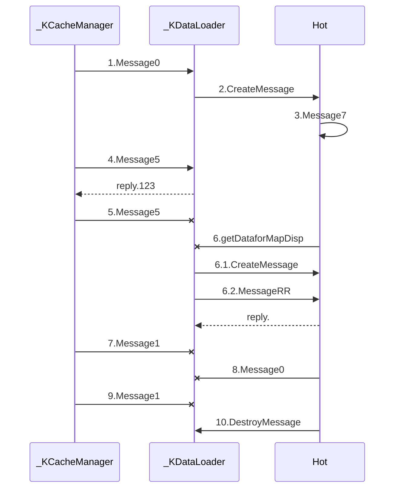

# Astah_Jude_UML_export_to_Markdown-mermaid-Plantuml-
Use Astah JS plugin, export astah diagrams data (such as flowchart, class chart ) to mermaid text fomat and Plantuml format

本项目提供将*Astah*中的UML图转换为文本图标格式的脚本，可以将Astah软件中的流程图，序列图，转换为*mermaid格式*和*Plantuml格式*
这两种格式都可以集成到markdown文件

使用文本格式保存UML图标，就可以对软件的设计文档进行版本管理

##Astah
Astah是专业的UML建模工具软件，请到其主页了解
http://astah.net/

使用本项目的js脚本，需要安装Astah的脚本插件，这是其插件的地址
https://github.com/ChangeVision/astah-script-plugin

[Download astah script plugin]( http://astah.change-vision.com/plugins/astah_script_plugin/1.0.4.html)


##mermaid
离线markdown编辑工具*Haroopad* 支持mermaid格式，可直接嵌入到markdown文本中转为图显示

##Plantuml

http://www.plantuml.com/plantuml/uml/SyfFKj2rKt3CoKnELR1Io4ZDoSa70000


##How to use

Sequence Diagram0 Sequence


```sequence
A->B
B->A
```
<!--
@startuml
Class01 <|-- Class02
Class03 *-- Class04
Class05 o-- Class06
Class07 .. Class08
Class09 -- Class10
@enduml
-->


